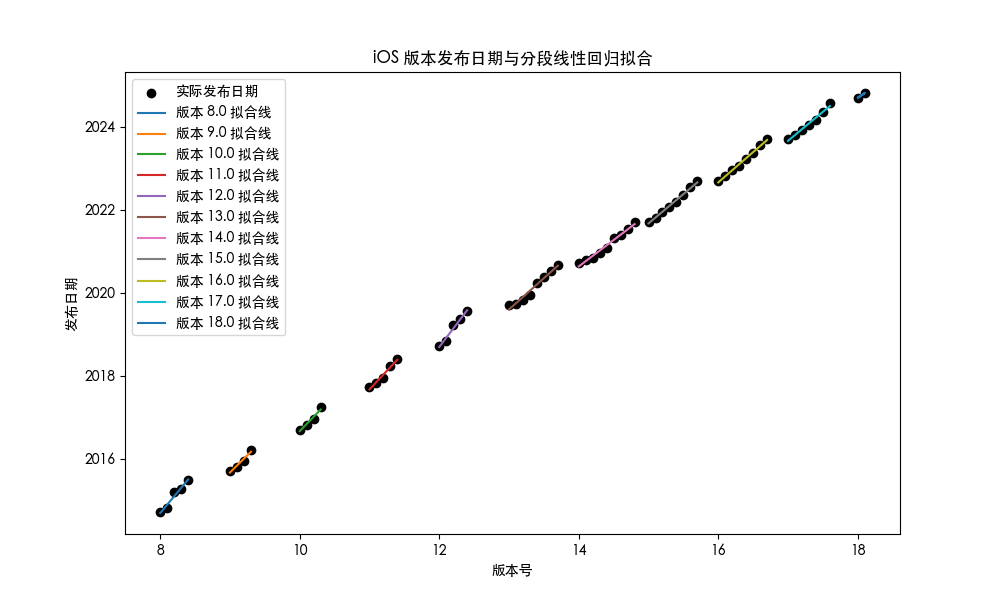

# iOS release time Prediction

# EN

Past iOS release dates and versions are stored in 'iOS release date.xlsx'. The future will be updated. 

The following techniques are used to improve prediction accuracy: 

1. Segment fitting 

2. Increase the weight of the last three major versions by 10% and reduce the weight of the other versions by 5% 

The results obtained are relatively accurate.

---

# CN

过去的 iOS 发布时间和版本被存放在了 `iOS release date.xlsx` 中。未来将会更新。

主要用了以下技术来提高预测精准度：

1. 分段拟合

2. 把最近三个大版本的权重增加 10%，其他版本的权重减少 5%

得到的结果较为精确。

---

# Results

## UPDATE in 2024/1/23：

```
Please enter the version number you want to predict: 17.4 

The predicted release date for version 17.4 is 2024-03-05 
```

## UPDATE in 2024/1/9：

```
Please enter the version number you want to predict: 17.3 

The predicted release date for version 17.3 is 2024-01-21 
```



---
